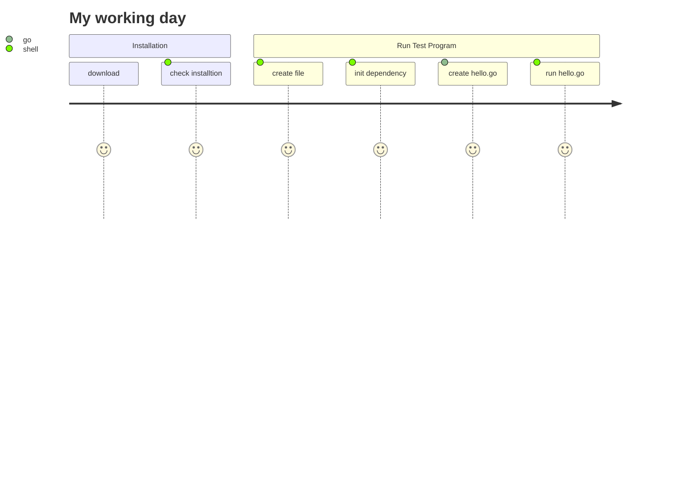

## A. Install go development environment
[go development DOC](https://go.dev/doc/install)

1. After installation, type this command in cmd to check whether the installtion is success or not
```cmd
$ go version
```

## B. Initial and Start First Prgram
1. Create project repository
```shell
mk dir hello
```

```shell
cd hello
```

2. Enable dependency tracking for code
```shell
go mod init example/hello
```

3. Create a "hello.go" file under "/hello" repository and add this code inside

Similar to Java <mark>"package main"</mark> and <mark>"fun main(){}"</mark> define the entry of program
```go
package main

import "fmt"

func main() {
	fmt.Println("Hello, World!")
}

```

4. Run the program
```shell
go run .
```


## User Journey Diagram



@Thank you!!

