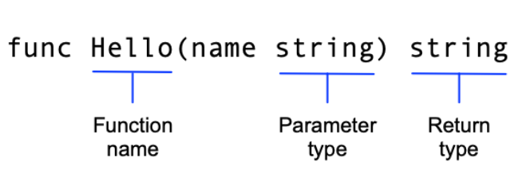

# Ceate a go module
## References
- [Develope and publish module](https://go.dev/doc/modules/developing)

## A. Setup and Initiation
1. Create go project
```shell
mkdir greetings
```

```shell
cd greetings
```
```shell
go mod init example.com/greetings
```
2. Create your own module "greetings"
create "greeting.go" under greetings repository, and paste this code
```go
package greetings

import "fmt"

// Hello returns a greeting for the named person.
func Hello(name string) string {
    // Return a greeting that embeds the name in a message.
    message := fmt.Sprintf("Hi, %v. Welcome!", name)
    return message
}
```

## B. Explain go function

- Unlike python, input type and output type of variable or object should be concerned
We have 2 methods to declare or assign variables

Similar to Python
```go
message := fmt.Sprintf("Hi, %v. Welcome!", name)
```

Similar to traditional program
```
var message string
message = fmt.Sprintf("Hi, %v. Welcome!", name)
```
