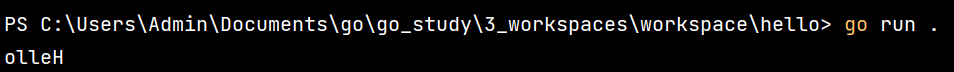
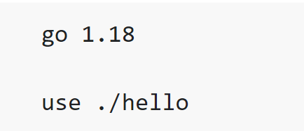
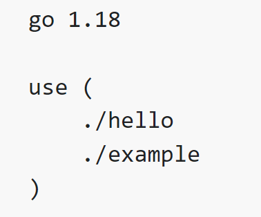
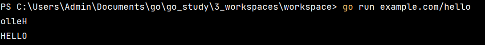
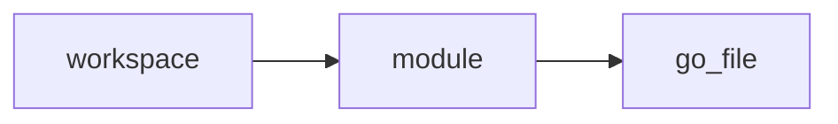

# Creat Workspaces
## A. Setup and Instantiation
1. Create workspaces directory and direct to that folder
```shell
mkdir "workspace"
```
```shell
cd workspace
```

2. Initial a module named "hello"
```shell
mkdir "hello"
```

```shell
cd hello
```
```shell
go mod init example.com/hello
```
3. Add module to dependency
```shell
go get golang.org/x/example
```

4. Add program
- create "hello.go" file
- add this code to the file
```go
package main

import (
	"fmt"

	"golang.org/x/example/stringutil"
)

func main() {
	fmt.Println(stringutil.Reverse("Hello"))
}
```
5. Test Result
```shell
go run .
```


## B. Create Workspace
1. Redirect the path "workspace" <mark>Aware your current path</mark>
```shell
cd ..
```
2. Add hello package to workspace
```shell
go work init ./hello
```
Output:

3. Run module in workspace
```shell
go run example.com/hello
```

## C. Download and modify the golang.org/x/example module
1. clone module from github
```shell
git clone https://go.googlesource.com/example
```
2. add module to workspace
```shell
go work use ./example
```


3. Add new function
under "example/stringutil", create a file named "toupper.go"
```go
package stringutil

import "unicode"

// ToUpper uppercases all the runes in its argument string.
func ToUpper(s string) string {
	r := []rune(s)
	for i := range r {
		r[i] = unicode.ToUpper(r[i])
	}
	return string(r)
}
```

4. modify "hello.go" to run "toupper" function
```go
package main

import (
	"fmt"

	"golang.org/x/example/stringutil"
)

func main() {
	fmt.Println(stringutil.Reverse("Hello"))
	fmt.Println(stringutil.ToUpper("Hello"))
}
```

5. Test Result
```shell
go run example.com/hello
```


FlowChart


- workspace: equal to project
- module: equal to library
- go file: contain functions
After adding to workflow, we can use "go run {module name}" run program directly, because it has main function which can is executable and recognized by interpreter

