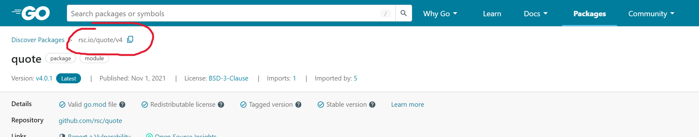
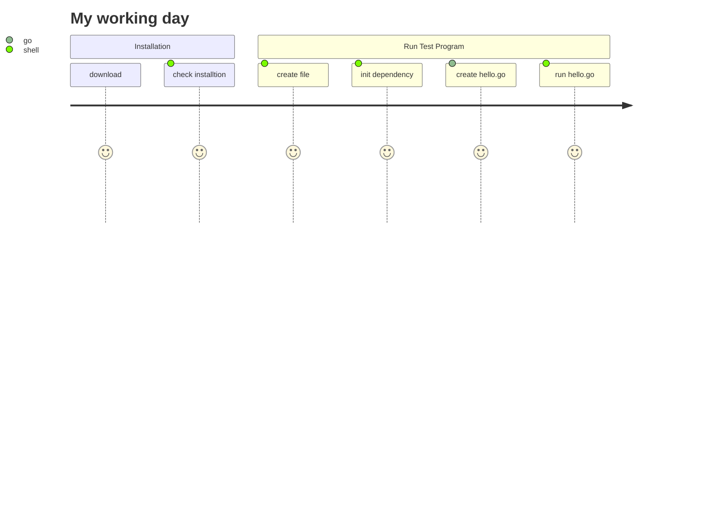

## A. Install go development environment
[go development DOC](https://go.dev/doc/install)

1. After installation, type this command in cmd to check whether the installtion is success or not
```cmd
$ go version
```

## B. Initial and Start First Prgram
1. Create project repository
```shell
mk dir hello
```

```shell
cd hello
```

2. Enable dependency tracking for code
```shell
go mod init example/hello
```

3. Create a "hello.go" file under "/hello" repository and add this code inside

Similar to Java <mark>"package main"</mark> and <mark>"fun main(){}"</mark> define the entry of program
```go
package main

import "fmt"

func main() {
	fmt.Println("Hello, World!")
}

```

4. Run the program
```shell
go run .
```

## C. Import external package
1. Search package from internet, we use "quote" as example

See details in this link[Pakage DOC](https://pkg.go.dev/rsc.io/quote/v4#section-readme)

Click the copy button form the website 


2. Edit the code to import package
```go
import "rsc.io/quote"

func main() {
	//fmt.Println("Hello, World!")
	fmt.Println(quote.Go())
}
```

3. Add package to dependency file
```shell
go mod tidy
```

## D. Package Management
- Initialize a module using go mod init {packagename}
- Add dependency using go get {packagename}
- Remove dependency by deleting the import references and running go mod tidy -v command
## User Journey Diagram



@Thank you!!

