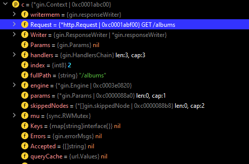

# Test with test.http

The Jetbrains IDE has a plugin called test.http. It allows us to test the API without using Postman or other tools. To
maintain the quality of codes, I suggest developers can use this tool to test the API.

# A. Create and initialize the module

1. Direct and create the working directory

```shell
mkdir web-service-gin
```

```shell
cd web-service-gin
```

2. Initialize the module

```shell
go mod init example/web-service-gin
```

# B. Required Packages

In this module, we need to install 2 external packages from go standard library

## A1. net/http

http is a package that provides HTTP client and server implementations.

References: https://pkg.go.dev/net/http

## A2. Gin Web Framework

Gin is a web framework written in Go (Golang). It features a martini-like API with much better performance, up to 40
times faster. If you need smashing performance, get yourself some Gin.

Features

* Zero allocation router
* Fast
* Middleware support
* Crash-free
* JSON validation
* Routes grouping
* Error management
* Rendering built-in
* Extendable

## A3. Codes

```go
import (
"net/http"

"github.com/gin-gonic/gin"
)
```

# C. Creat the testing data

1. Data Structure

```go
// album represents data about a record album.
type album struct {
ID     string  `json:"id"`
Title  string  `json:"title"`
Artist string  `json:"artist"`
Price  float64 `json:"price"`
}
```

2. Create lists of testing data

```shell
func main() {
	// albums slice to seed record album data.
	var albums = []album{
		{ID: "1", Title: "Blue Train", Artist: "John Coltrane", Price: 56.99},
		{ID: "2", Title: "Jeru", Artist: "Gerry Mulligan", Price: 17.99},
		{ID: "3", Title: "Sarah Vaughan and Clifford Brown", Artist: "Sarah Vaughan", Price: 39.99},
	}
}

```

# D. Write a handler to return all items

1. Crate a handler function

```go
func getAlbums(c *gin.Context) {
c.IndentedJSON(http.StatusOK, albums)
}
```

*gin.Context is the most important part of Gin. It allows us to pass variables between middleware, manage the flow. It
defines how user access to the api



~~External Code for IndentedJSON~~ <mark>This code only for you to understand the architecture</mark>

```go
// IndentedJSON serializes the given struct as pretty JSON (indented + endlines) into the response body.
// It also sets the Content-Type as "application/json".
// WARNING: we recommend using this only for development purposes since printing pretty JSON is
// more CPU and bandwidth consuming. Use Context.JSON() instead.
func (c *Context) IndentedJSON(code int, obj any) {
c.Render(code, render.IndentedJSON{Data: obj})
}
```

## Params

- code int: The HTTP status code e.g. 200, 404, 500 etc.
- obj any: The struct/object to be serialized as JSON

# Test the handler

Add the handler to the main function

```go
func main() {
// Default returns an Engine instance with the Logger and Recovery middleware already attached.
router := gin.Default()
router.GET("/albums", getAlbums)
router.Run("localhost:8080")
}
```

## Test

```http request
### Get all albums
GET http://localhost:8080/albums
Accept: application/json
```

## Result

```http request
GET http://localhost:8080/albums

HTTP/1.1 200 OK
Content-Type: application/json; charset=utf-8
Date: Sat, 27 May 2023 10:11:06 GMT
Content-Length: 666

[
  {
    "id": "1",
    "title": "Blue Train",
    "artist": "John Coltrane",
    "price": 56.99
  },
  {
    "id": "2",
    "title": "Jeru",
    "artist": "Gerry Mulligan",
    "price": 17.99
  },
  {
    "id": "3",
    "title": "Sarah Vaughan and Clifford Brown",
    "artist": "Sarah Vaughan",
    "price": 39.99
  },
  {
    "id": "4",
    "title": "The Modern Sound of Betty Carter",
    "artist": "Betty Carter",
    "price": 49.99
  },
  {
    "id": "4",
    "title": "The Modern Sound of Betty Carter",
    "artist": "Betty Carter",
    "price": 49.99
  }
]
Response file saved.
> 2023-05-27T181106.200.json

Response code: 200 (OK); Time: 5ms (5 ms); Content length: 666 bytes (666 B)

```

# E. Write a handler to add a new item

```go
// postAlbums adds an album from JSON received in the request body.
func postAlbums(c *gin.Context) {
var newAlbum album

// Call BindJSON to bind the received JSON to
// newAlbum.
if err := c.BindJSON(&newAlbum); err != nil {
return
}

// Add the new album to the slice.
albums = append(albums, newAlbum)
c.IndentedJSON(http.StatusCreated, newAlbum)
}
```

Add handler to the main function

```go
func main() {
// Default returns an Engine instance with the Logger and Recovery middleware already attached.
router := gin.Default()
router.POST("/albums", postAlbums)
router.Run("localhost:8080")
}
```

## Testing

```http request
### GET request with environment variables
GET {{host}}/get?show_env={{show_env}}
Accept: application/json
```

## Result

```http request
POST http://localhost:8080/albums

HTTP/1.1 201 Created
Content-Type: application/json; charset=utf-8
Date: Sat, 27 May 2023 10:11:03 GMT
Content-Length: 116

{
  "id": "4",
  "title": "The Modern Sound of Betty Carter",
  "artist": "Betty Carter",
  "price": 49.99
}
Response file saved.
> 2023-05-27T181103.201.json

Response code: 201 (Created); Time: 5ms (5 ms); Content length: 116 bytes (116 B)

```

# F. Write a handler to get a specific item

```go
// getAlbumByID locates the album whose ID value matches the id
// parameter sent by the client, then returns that album as a response.
func getAlbumByID(c *gin.Context) {
id := c.Param("id")

// Loop through the list of albums, looking for
// an album whose ID value matches the parameter.
for _, a := range albums {
if a.ID == id {
c.IndentedJSON(http.StatusOK, a)
return
}
}
c.IndentedJSON(http.StatusNotFound, gin.H{"message": "album not found"})
}
```

Add the handler to the main function

```go
router.GET("/albums/:id", getAlbumByID)
```

## Testing

```http request
### Get an album by id "1"
GET http://localhost:8080/albums/1
```

## Result

```http request
GET http://localhost:8080/albums/1

HTTP/1.1 200 OK
Content-Type: application/json; charset=utf-8
Date: Sat, 27 May 2023 10:16:36 GMT
Content-Length: 95

{
  "id": "1",
  "title": "Blue Train",
  "artist": "John Coltrane",
  "price": 56.99
}
Response file saved.
> 2023-05-27T181637.200.json

Response code: 200 (OK); Time: 6ms (6 ms); Content length: 95 bytes (95 B)
```

# G. Conclusion

In this chapter, we learn how to create a simple REST API using Gin. We learn how GET, POST, and GET by ID works.
Obviously, it only includes basic knowledge of developing a REST API. In the next chapter, we will learn how to connect
to the database and create a more complex REST API. In the future, we will learn security and other micro-services with
go languages.
